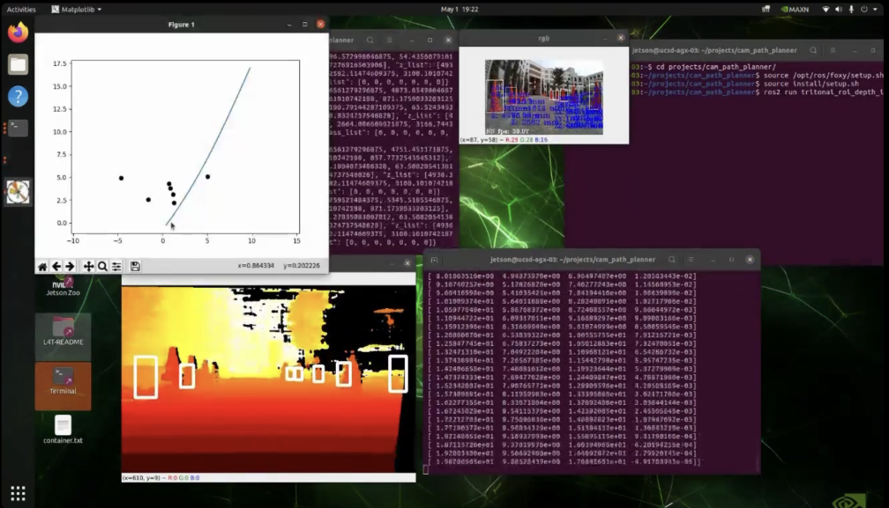

# cam_path_planner

This ROS2 package consists of the following modules:

1. Detecting cones with YOLOv5 and extracting their depth with stereo camera
2. Path planning
3. Path visualization

## Demo

